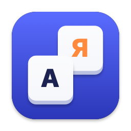
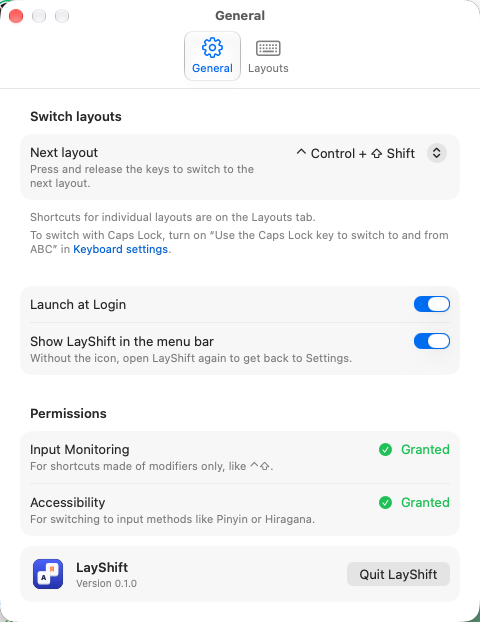
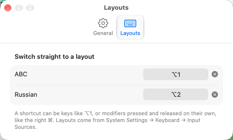

<p align="center">
  
</p>

<h1 align="center">LayShift</h1>

<p align="center">
  A tiny, native macOS utility that switches keyboard layouts with the shortcuts you want.<br>
  Press and release ⌃⇧ like on Windows, or give every layout its own key.
</p>

<p align="center">
  <a href="https://github.com/devopscodepro/layshift/releases/latest"></a>
  
  <a href="https://github.com/devopscodepro/layshift/actions/workflows/ci.yml"></a>
  <a href="LICENSE"></a>
</p>

<p align="center">
  <picture>
    <source media="(prefers-color-scheme: dark)" srcset="docs/images/settings-general-dark.png">
    
  </picture>
</p>

macOS lets you switch input sources with ⌃Space, and only with a key combination. LayShift adds what people coming from Windows or from the old MLSwitcher miss: switch by tapping modifiers alone, and jump straight to a specific layout.

## Features

- **Modifier-only shortcuts.** Press and release ⌃⇧, ⌥⇧, ⌘⇧, a single ⌘ or ⌥, the right ⌘ only, or fn/🌐. Holding the keys with another key, like ⌃⇧R, never switches.
- **Any layouts, not just two.** Works with every input source enabled in System Settings, including input methods like Hiragana or Pinyin, and makes them take effect in the front app right away.
- **A key per layout.** Give ABC ⌥1 and Russian ⌥2, or the left ⌘ and the right ⌘, on the Layouts tab.
- **Left and right told apart.** Recorded shortcuts know which side you pressed. Presets from the list work with either side.
- **Follows the system.** Add or remove an input source in System Settings and LayShift picks it up.
- **Honest about permissions.** Asks for Input Monitoring only when you set a modifier-only shortcut, for Accessibility only if you use input methods, and shows the status in Settings.
- **Native and tiny.** Swift, AppKit and SwiftUI, zero dependencies, zero network access. English and Russian.

## Install

1. Download `LayShift-x.y.z.dmg` from [Releases](https://github.com/devopscodepro/layshift/releases/latest).
2. Open it and drag the keys into **Applications**.
3. Launch LayShift, pick a shortcut for **Next layout** and allow Input Monitoring when macOS asks.

A `.zip` is there too if you prefer it.

Or with [Homebrew](https://brew.sh):

```sh
brew install --cask devopscodepro/tap/layshift
```

Builds are signed with a Developer ID and notarized by Apple. Requires macOS 13 Ventura or later, runs natively on Apple silicon and Intel.

## Using it

| Where | What |
|---|---|
| Menu bar icon | Shows the current layout, opens Settings |
| **General** | Next layout shortcut, Launch at Login, menu bar icon, permissions |
| **Layouts** | A shortcut for each enabled input source |

Shortcuts can be keys with modifiers, like ⌥1, or modifiers pressed and released on their own. Click a shortcut field, press what you want, done. Esc cancels, Delete clears.

<p align="center">
  <picture>
    <source media="(prefers-color-scheme: dark)" srcset="docs/images/settings-layouts-dark.png">
    
  </picture>
</p>

## Permissions

- **Input Monitoring** is needed to see modifier keys system-wide. LayShift only looks at ⌃ ⌥ ⇧ ⌘ fn and at *whether* another key or mouse button was pressed in between. It never reads what you type.
- **Accessibility** is needed only for input methods (Japanese, Chinese, Korean…). macOS does not apply such a switch to the front app until it regains focus; LayShift fixes that by pressing the system “Select the previous input source” shortcut for you.

If a password field is active, macOS blocks all of this (secure input) and the menu says so.

## FAQ

**Ctrl+Shift opens something else in my app.**
LayShift only reacts when the modifiers are pressed and released alone. If an app uses a plain ⌃⇧ tap itself, pick another combination.

**The fn/🌐 key doesn't switch.**
macOS also acts on that key. Set System Settings → Keyboard → “Press 🌐 key to” to *Do Nothing*; LayShift shows a reminder when needed.

**Can I switch with Caps Lock?**
macOS has that built in: System Settings → Keyboard → Input Sources → “Use the Caps Lock key to switch to and from ABC”. LayShift leaves it alone.

**I don't see the icon in the menu bar.**
It can be hidden in Settings, or pushed out by other icons. Open LayShift again from Applications or Spotlight and Settings will show up.

## Building from source

Requirements: Xcode 16 or later.

```sh
git clone https://github.com/devopscodepro/layshift.git
cd layshift
xcodebuild -project LayShift.xcodeproj -scheme LayShift -configuration Release -derivedDataPath build build
open build/Build/Products/Release/LayShift.app
```

Run the tests with:

```sh
xcodebuild -project LayShift.xcodeproj -scheme LayShift -derivedDataPath build test
```

Local builds are signed ad hoc, no Apple Developer account needed. Note that macOS ties the Input Monitoring permission to the app's signature, so an ad hoc build asks again after every rebuild.

## Contributing

Bug reports, translations and small pull requests are welcome, see [CONTRIBUTING.md](CONTRIBUTING.md). Questions and ideas go to [Discussions](https://github.com/devopscodepro/layshift/discussions), security issues to a [private report](SECURITY.md).

## License

[MIT](LICENSE) © 2026 Aleksei Popov
